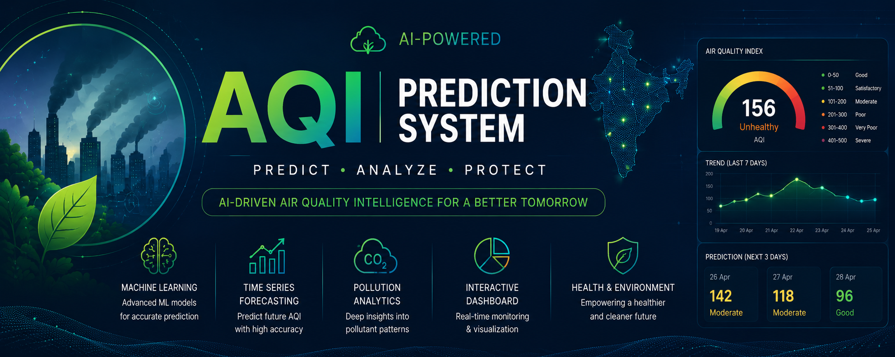

# 🌍 AQI Prediction System



> AI-powered Air Quality Prediction and Analytics Platform.

---

## 🚀 Features

- AQI Prediction
- Pollution Classification
- Time Series Forecasting
- Interactive Dashboard
- Real-time Analytics

---

## 🧠 Machine Learning Models

- Classification Model
- Clustering Model
- Time Series Forecasting Model

---

## ⚙️ Tech Stack

- Python
- Flask/FastAPI
- Machine Learning
- TensorFlow
- HTML/CSS/JavaScript


---

## 📊 Prediction Results


---

## 🚀 Installation

```bash
pip install -r requirements.txt
python app.py
